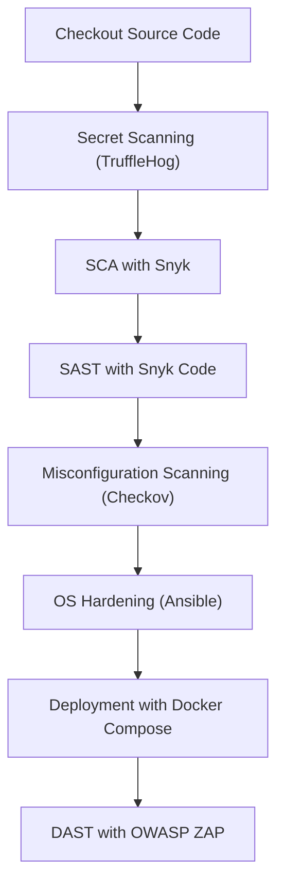

# CI/CD Security Pipeline for vuln-bank

This repository is a fork of the original **vuln-bank** project with the addition of a **Jenkinsfile** for automated **CI/CD pipeline** that focuses on **security scanning**.  
The pipeline is designed to detect **secrets, vulnerable dependencies, code issues, misconfigurations, OS hardening compliance, and runtime vulnerabilities (DAST)**.

---

## 🔧 Pipeline Architecture & Workflow

The pipeline follows this workflow:

---

## 🛠️ Tools Used

| Tool / Framework | Purpose in Pipeline |
|------------------|---------------------|
| **TruffleHog**   | Secret scanning – detects leaked API keys, tokens, and credentials in code. |
| **Snyk SCA**     | Software Composition Analysis – scans Python dependencies for vulnerabilities. |
| **Snyk SAST**    | Static Application Security Testing – analyzes Python source code for bugs and security risks. |
| **Checkov**      | Misconfiguration scanning – checks Dockerfile and IaC misconfigurations. |
| **Ansible (dev-sec.os-hardening)** | Server OS hardening and compliance enforcement. |
| **OWASP ZAP**    | Dynamic Application Security Testing (DAST) – scans the running web application. |
| **Jenkins**      | CI/CD orchestrator for executing the pipeline. |
| **Email Notification (emailext)** | Sends alerts if critical/high vulnerabilities are found. |
| **Defect Dojo** | Vulnerability Manager. |

---

## 🚨 Handling Critical Findings

The pipeline collects reports from each tool in **JSON/XML/HTML** formats.  
When **High or Critical findings** are detected:

- Pipeline marks the stage with security issues.  
- Adds the findings to a short summary.  
- Sends **email notification** to the communication channel.  
- Full details can be reviewed in the Jenkins artifacts (JSON/XML/HTML scan reports).  

If **no High/Critical findings** are present, the pipeline proceeds normally without sending an email.

---

## 📌 To-Do List

The following tasks are still pending or need improvements:

- [ ] **Email Notifications**: Currently, email is only sent for TruffleHog and SAST findings, while SCA and DAST results even with high or critical issues are not included. 
- [ ] **Hardening & Compliance Checks**: Ansible hardening role is not yet running smoothly in the pipeline.  
- [ ] **Misconfiguration Scanning**: Checkov reports are not fully integrated into the findings.  
- [ ] **Additional SAST with LLM**: Integrate LLM-based code analysis to detect logical vulnerabilities.  
- [ ] **Integration with Vulnerability Manager**: Not yet running smoothly.  

---

## 📎 Notes

- This pipeline is still under active development.  
- The end goal is to achieve a **comprehensive end-to-end security CI/CD pipeline** that can automatically detect, report, and manage vulnerabilities.  

---

